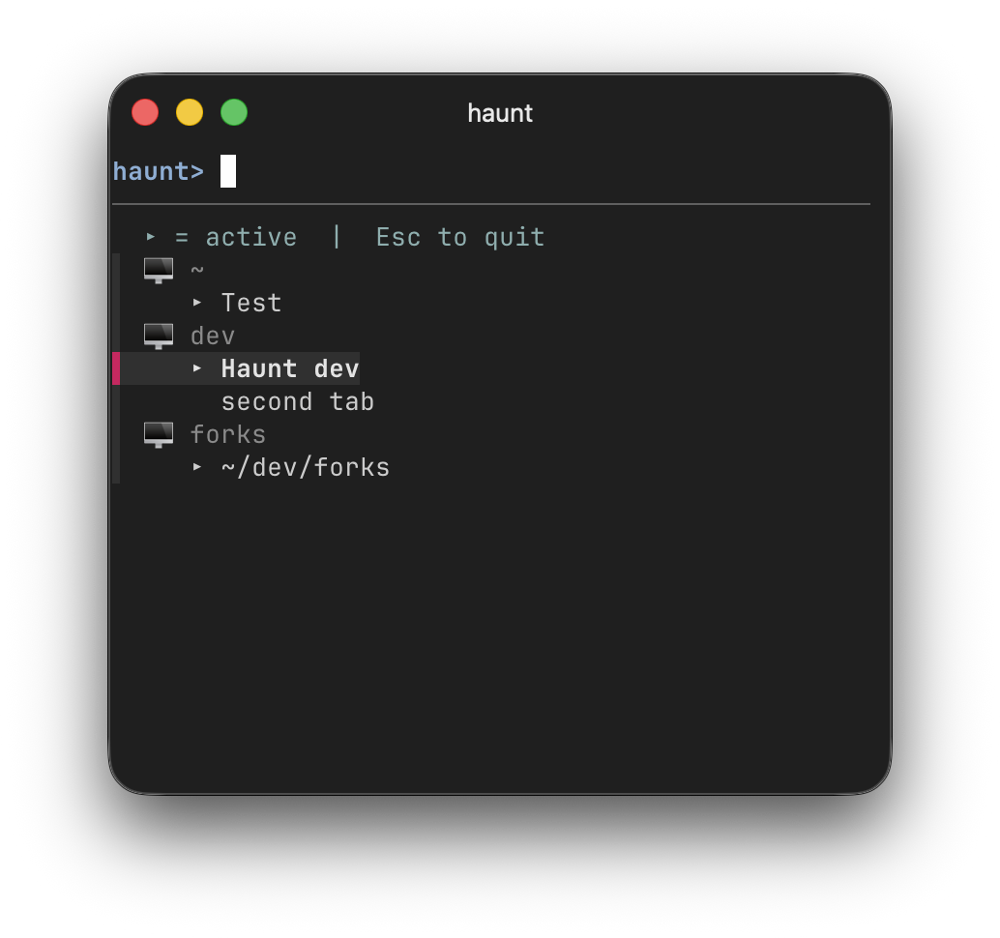

# 👻 haunt

A tab switcher and session dashboard for [Ghostty](https://ghostty.org).



haunt shows an interactive, auto-refreshing list of all your Ghostty tabs — across all windows and macOS Spaces. Tabs are grouped by project directory, with active tabs highlighted. Select a tab to switch to it instantly, even across Spaces.

## Why

If you work on multiple projects — each in its own Ghostty window, maybe on different macOS Spaces — you know the pain: you lose track. Which tab was running your dev server? Where was that Claude Code session? Cmd-tabbing through Spaces is slow and disorienting.

haunt gives you a single, persistent overview of everything that's open, and lets you jump there instantly.

## Features

- **Cross-Space switching** — jump to any tab in any window on any Space
- **Grouped by project** — tabs are organized by their common working directory
- **Active tab indicators** — see which tabs are selected at a glance
- **Claude Code status** — shows ◌ when Claude is working, highlights the line when it needs your input (via bundled hook)
- **Auto-refresh** — the list updates every 2 seconds
- **Stays open** — switch between tabs without relaunching
- **Summon mode** — bring haunt to focus from a hotkey
- **Hook system** — extensible via plugins (see [CONTRIBUTING.md](CONTRIBUTING.md))

## Requirements

- **macOS** (uses Ghostty's native AppleScript API)
- **Ghostty** 1.3.0+
- **fzf** 0.48+ (`brew install fzf`)

## Install

```bash
curl -fsSL https://raw.githubusercontent.com/janpaepke/haunt/main/install.sh | bash
```

This downloads haunt to `~/.local/share/haunt/` and symlinks the binary to `~/.local/bin/haunt`.

To update, just re-run the same command.

## Uninstall

```bash
rm -rf ~/.local/share/haunt ~/.local/bin/haunt
```

## Usage

```bash
haunt              # Launch the dashboard
haunt --summon     # Focus an already-running instance
haunt --next       # Jump to the next tab that needs attention
haunt --version    # Show version
haunt --help       # Show help
```

Inside haunt, use **Page Down / Page Up** to jump between window groups.

### Global hotkeys

Bind these to system-wide keyboard shortcuts for quick access:

- `haunt --summon` — open the dashboard
- `haunt --next` — jump straight to the next tab that needs your input

**Raycast** (free)
Create Script Commands for each and assign hotkeys.

**Alfred** (requires Powerpack)
Create a workflow per command: Hotkey trigger → Run Script.

**macOS Shortcuts**
Create a shortcut with a "Run Shell Script" action (`haunt --summon`), then assign a keyboard shortcut in System Settings → Keyboard → Keyboard Shortcuts → App Shortcuts.

**Hammerspoon** (free, Lua-based)
```lua
hs.hotkey.bind({"alt"}, "t", function()
  os.execute("haunt --summon")
end)
```

**skhd** (free, lightweight)
```
alt - t : haunt --summon
```

## How it works

haunt queries Ghostty's AppleScript API to enumerate all windows and tabs with their titles, selection state, and working directories. It presents them in an [fzf](https://github.com/junegunn/fzf) interface that auto-refreshes via fzf's HTTP listener. Selecting a tab uses Ghostty's `select tab` and `activate window` AppleScript commands, which trigger a macOS Space switch when needed.

## Current limitations

- **macOS only** — haunt relies on Ghostty's AppleScript API, which is macOS-specific. Linux/Windows support would require Ghostty's D-Bus or native IPC (not yet available).
- **Ghostty only** — the AppleScript interface is specific to Ghostty. Supporting other terminals (iTerm2, WezTerm, etc.) would need separate backends.
- **No session persistence** — haunt shows live tabs but doesn't save/restore sessions across Ghostty restarts.

PRs welcome — see [CONTRIBUTING.md](CONTRIBUTING.md) and the issues for planned work.

## License

MIT
